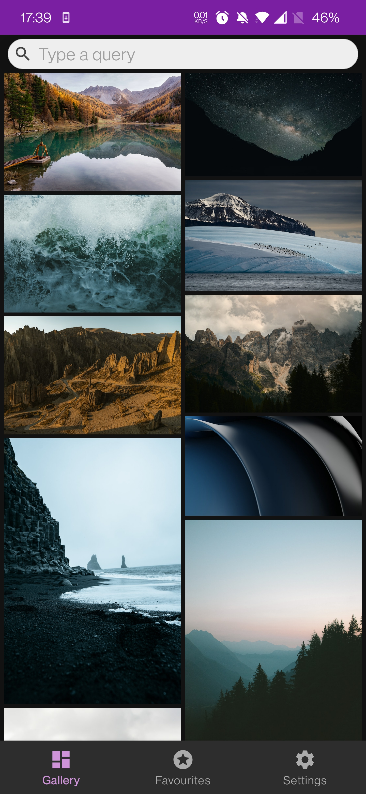
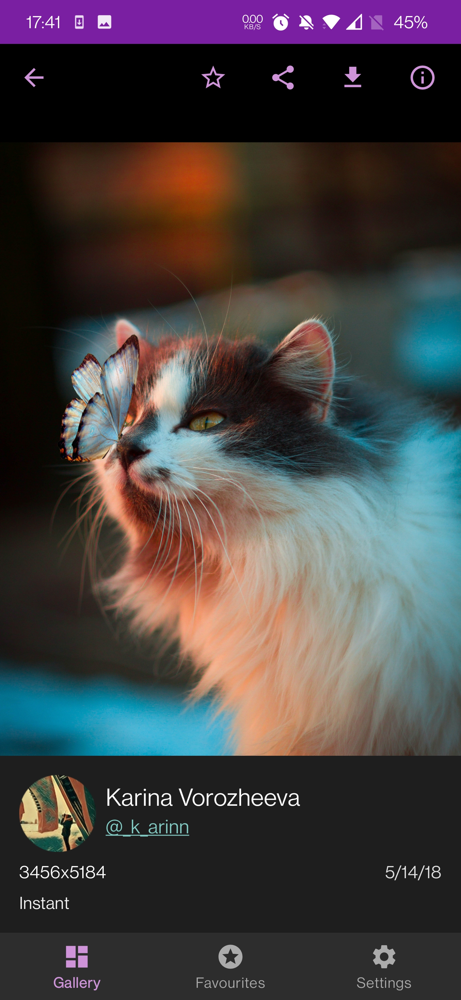
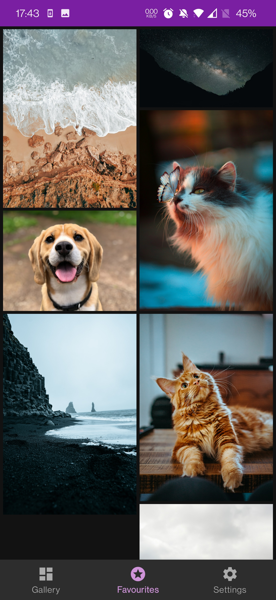

# Android Unsplash gallery (sample project)

[](https://kotlinlang.org)
[](https://developer.android.com/studio/releases/gradle-plugin)
[](https://gradle.org)
[](https://developer.android.com/about/versions/14)


[](https://www.codefactor.io/repository/github/maxmakarovdev/android-unsplash-gallery-sample)
[](https://codebeat.co/projects/github-com-maxmakarovdev-android-unsplash-gallery-sample-master)


## App description
<p>
  
  
  
</p>

//todo description

## Tech stack

* [Kotlin](https://kotlinlang.org/)
   * [Coroutines](https://kotlinlang.org/docs/reference/coroutines-overview.html)
   * [Flow](https://kotlinlang.org/docs/flow.html)
* Architecture
  * [MVVM + MVI + Repository Pattern](https://developer.android.com/topic/architecture/recommendations)
  * [Single Activity](https://developer.android.com/topic/architecture/recommendations)
  * [Multi-module](https://developer.android.com/topic/modularization)
  * [Android Architecture components](https://developer.android.com/topic/libraries/architecture) ([ViewModel](https://developer.android.com/topic/libraries/architecture/viewmodel), [Navigation](https://developer.android.com/topic/libraries/architecture/navigation/), [Lifecycle](https://developer.android.com/topic/libraries/architecture/lifecycle))
  * [Dagger/Hilt DI](https://developer.android.com/training/dependency-injection/hilt-android)
* UI
  * [WIP] [Jetpack Compose](https://developer.android.com/jetpack/compose)
  * [Material Design 3 components](https://m3.material.io/components) 
  * [Paging library v3](https://developer.android.com/topic/libraries/architecture/paging/v3-overview)
  * [Coil](https://github.com/coil-kt/coil)
  * [Lottie](http://airbnb.io/lottie)
  * [BlurHash](https://blurha.sh/)
* Data
  * [Retrofit](https://square.github.io/retrofit/)
  * [OkHttp](https://square.github.io/okhttp/)
  * [Room](https://developer.android.com/jetpack/androidx/releases/room)
* Testing
  * [WIP] [JUnit 5](https://junit.org/junit5/) + [Mockk](https://mockk.io/)
* Compiling and building
  * [KSP](https://kotlinlang.org/docs/ksp-overview.html)
* Code analysis
  * [WIP] [Detekt](https://github.com/arturbosch/detekt)


## Features Roadmap

- [x] Gallery screen
  - [x] Image list
  - [x] Data loading with pagination
  - [x] Search
- [x] Favorites screen
- [x] Fullscreen image view
  - [x] Add to favorites
  - [x] Share
  - [x] Download
  - [x] Zoomable image view
  - [x] Show image info details
- [ ] Settings screen


## Tech Roadmap

- [x] Load the image list with Retrofit, Coroutines/Flow and Paging 3 library
- [x] Room database for storing favorite images
- [x] Multi-module
- [x] Dagger/Hilt
- [ ] Unit tests
- [ ] Jetpack Compose


## Minor tasks and enhancements 

* Handle multiple backstacks navigation https://developer.android.com/guide/navigation/backstack/multi-back-stacks
* Display a number of requests left (X-Ratelimit-Remaining)
* Error handling
* Gradle improvements
* Animations (Image opening, ...)
* Fonts
* Add more info in the README.md


## Known issues

* ...


## Getting Started

To open this project:
* Clone the project via Git and open it via Android Studio

To launch the app:
* Register as a developer in Unsplash and create a demo project https://unsplash.com/oauth/applications/new
* Put a generated Access Key and Private Key to the `unsplash.keys` file in the root project directory:
   ```
   access_key="<your access key>"
   secret_key="<your secret key>"
   ```
* Run the app and enjoy!


## Links


## License

```
Designed and developed by 2023 maxmakarovdev (Maksim Makarov)

Licensed under the Apache License, Version 2.0 (the "License");
you may not use this file except in compliance with the License.
You may obtain a copy of the License at

   http://www.apache.org/licenses/LICENSE-2.0

Unless required by applicable law or agreed to in writing, software
distributed under the License is distributed on an "AS IS" BASIS,
WITHOUT WARRANTIES OR CONDITIONS OF ANY KIND, either express or implied.
See the License for the specific language governing permissions and
limitations under the License.
```